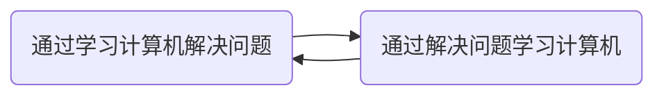

---

layout: post

title: Hey, U find me!

category: About

tags: me

keywords: me

---

### 我

网名：三秋，取自《滕王阁序》“时维九月，序属三秋。” 九月生，天秤座。

十分热爱思考，善于分析、判断、总结和预测。

### 计算机

在很久以前使用计算机解决了问题，从此便对计算机产生了浓厚兴趣。

### 如何找到我

GitHub: [fankcoder](https://github.com/fankcoder)

微博: [似叶三秋](https://weibo.com/u/2424646683)

知乎: [似叶三秋](https://www.zhihu.com/people/si-xie-san-qiu/activities)

Bilibili: [三秋Q3Q](https://space.bilibili.com/38307214)

Email: fankcoder#gmail.com
